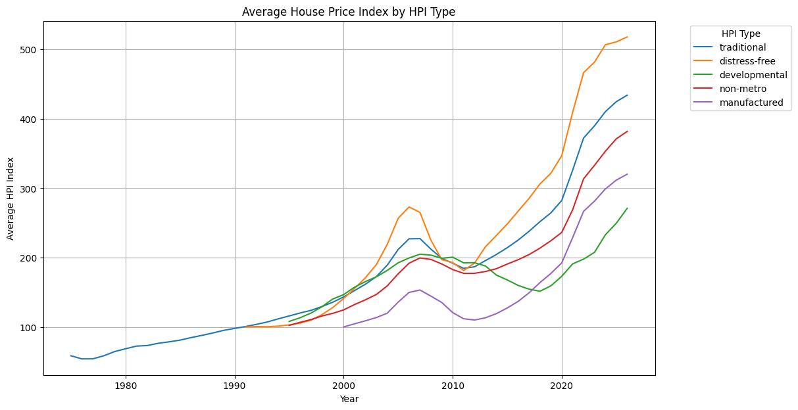
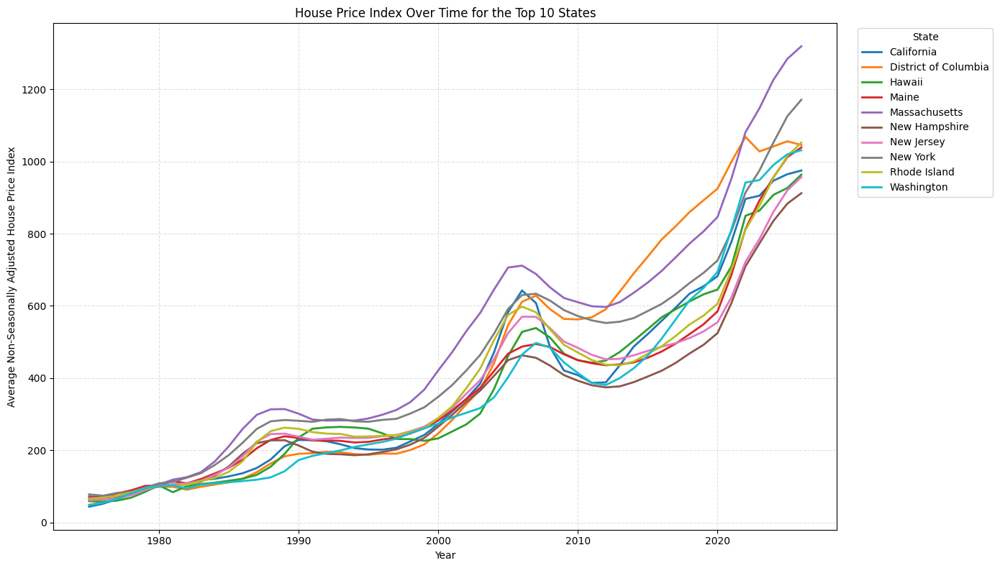

# Getting into Business: Real Estate Investment Data Exploration

**Authors:** John Tapia, Jacob Dudas, James Pfaff

This notebook explores the Federal Housing Finance Agency (FHFA) House Price Index (HPI) dataset to understand its coverage, attributes, and housing price trends.

**Data source:** https://www.fhfa.gov/data/house-price-index

## 1. Understanding the Data

### When was the data acquired?

After getting the relative path of the csv file, I named it df. I opened the df and can see that the data ranges from 1975 to 2026. The FHFA publishes releases monthly and quarterly. It combines current and historical data.

### Where was the data acquired?

This data was aquired in the United States as a whole. Specifically, this data is divided up between the 9 U.S Census Divisions, individual U.S states, the Metropolitan area, and Puerto Rico.

### How was the data acquired?

The FHFA House Price Index tracks changes in single-family home prices over time. It uses real mortgage and housing transactions. FHFA gets mortgage information from Fannie Mae and Freddie Mac, government sponsored companies. It looks at homes that were sold or refinanced more than once and compares the prices from each transaction. This helps show how home values changed over time. The data has been collected since 1975 and is considered observational data because it comes from real housing transactions. The HPI is basically measuring how much home prices have changed over time.

### What are the attributes of this dataset?

The FHFA data dictionary used in the notebook describes these fields:

| Field Name | Content | 
| --- | --- | 
| hpi_type | type of data |
| hpi_flavor | flavor of HPI |
| frequency | frequency of data | 
| level | level of geography | 
| place_name | place name | 
| place_id | place ID |
| yr | year | 
| period | period |  
| index_nsa | index, non seasonally adjusted | 
| index_sa | index, seasonally adjusted | 
| Median Price ($) | median price | 

The loaded `hpi_master.csv` also contains `rstderr` (relative standard error) and `note` (notes for observations).

### What types of data do the attributes contain?

| Column Name | Data Type |
| --- | --- |
| hpi_type | Nominal |
| hpi_flavor | Nominal |
| frequency | Nominal |
| level | Nominal |
| place_name | Nominal |
| place_id | Nominal |
| yr | Interval |
| period | Ordinal |
| index_nsa | Interval |
| index_sa | Interval |
| rstderr | Ratio |
| note | Nominal |

The columns hpi_type, hpi_flavor, frequency, level, place_name, place_id, and note are nominal because they are categories with no numerical value. The period column is ordinal because the months or quarters follow an order, while yr is interval because the difference between years is important but there is no true year zero. The index_nsa and index_sa columns are interval because they show changes from a base index value of 100, and rstderr is ratio because zero represents no standard error and the values can be compared.

## 2. Data Summary and Initial Insights

### Missing or empty values

The notebook removes tab characters and changes empty `note` values to missing values. The missing-value counts from that run are:

| Column | Missing values |
| --- | --- |
| hpi_type | 0 |
| hpi_flavor | 0 |
| frequency | 0 |
| level | 0 |
| place_name | 0 |
| place_id | 0 |
| yr | 0 |
| period | 0 |
| index_nsa | 0 |
| index_sa | 89897 |
| rstderr | 127791 |
| note | 185560 |

The dataset has missing values in index_sa, rstderr, and note. Missing values in note usually mean there is no special note for that obeservation, so they do not need to be removed. For analyses that require seasonally adjusted values or relative standard errors, I would use only the rows where the needed column has a value instead of deleting all rows with missing data.

### Summary statistics

**Numerical attributes**

| Statistic | yr | index_nsa | index_sa | rstderr |
| --- | ---: | ---: | ---: | ---: |
| count | 186,011.00 | 186,011.00 | 96,114.00 | 58,220.00 |
| mean | 2,006.16 | 199.96 | 216.67 | 2.67 |
| std | 12.00 | 116.13 | 113.51 | 2.22 |
| min | 1,975.00 | 18.60 | 72.78 | 0.00 |
| 25% | 1,997.00 | 119.61 | 137.29 | 1.06 |
| 50% | 2,007.00 | 172.13 | 187.21 | 2.05 |
| 75% | 2,016.00 | 241.38 | 258.34 | 3.60 |
| max | 2,026.00 | 1,326.94 | 1,043.20 | 15.75 |

**Categorical attributes**

| --- | hpi_type | hpi_flavor | frequency | level | place_name | place_id |
| --- | --- | --- | --- | --- | --- | --- |
| Count | 186011 | 186011 | 186011 | 186011 | 186011 | 186011 |
| Unique | 5 | 3 | 2 | 4 | 472 | 472 |
| Mode | traditional | all-transactions | quarterly | MSA | United States | USA |
| Mode Freq. | 177642 | 89791 | 181751 | 145480 | 1128 | 1128 |

**Period frequency (months or quarters):**

| Period | Count |
| ---: | ---: |
| 1 | 46,204 |
| 2 | 46,337 |
| 3 | 45,291 |
| 4 | 45,359 |
| 5 | 360 |
| 6 | 360 |
| 7 | 350 |
| 8 | 350 |
| 9 | 350 |
| 10 | 350 |
| 11 | 350 |
| 12 | 350 |

### Visualizations

The first line graph shows how the House Price Index changed over time for all observations in the dataset, dependent on the type of housing. For the most part, it has increased, with 2008 being the exception due to the financial crisis. By comparing categories such as traditional, distress-free, developmental, non-metro, and manufactured housing, investors can identify differences in long-term price growth and periods of decline or recovery.

The second graph looks at the 10 states with the highest recent House Price Index values. These states have had larger overall increases from their starting index values, but this does not mean they have the highest home prices or are the best places to invest. Investors should also look at other things before making a decision

## 3. Expanding Your Investment Knowledge

**Additional dataset:** [FEMA National Risk Index: All Counties](https://www.fema.gov/about/openfema/data-sets/national-risk-index-data)

### Why is this dataset useful, and how does it complement FHFA HPI?

1. Why This Dataset Is Useful

The FEMA National Risk Index provides metrics quantifying natural hazard and financial vulnerability for every U.S. county. It bundles up properties by county. Key metrics in the dataset include:

FEMA county data preview
The first five rows displayed by df_nri.head() in the notebook:

### FEMA county data preview

The first five rows displayed by `df_nri.head()` in the notebook:

| STATE | STATEABBRV | COUNTY | STCOFIPS | POPULATION | BUILDVALUE | RISK_SCORE | RISK_RATNG | EAL_SCORE | EAL_VALB | CFLD_EALB | HRCN_EALB | WFIR_EALB |
| --- | --- | --- | --- | --- | --- | --- | --- | --- | --- | --- | --- | --- |
| Alabama | AL | Autauga | 01001 | 58764 | 1.02414e+10 | 57.57 | Relatively Low | 59.87 | 1.38535e+07 | NaN | 633591 | 30029.8 |
| Alabama | AL | Baldwin | 01003 | 231365 | 5.16023e+10 | 96.7239 | Relatively High | 96.6275 | 2.08447e+08 | 3.70494e+06 | 1.50899e+08 | 1.28274e+06 |
| Alabama | AL | Barbour | 01005 | 25160 | 5.44182e+09 | 48.1234 | Relatively Low | 30.5384 | 5.5552e+06 | NaN | 612108 | 21612 |
| Alabama | AL | Bibb | 01007 | 22239 | 3.53263e+09 | 39.1221 | Very Low | 31.0025 | 6.12857e+06 | NaN | 43837.4 | 25795 |
| Alabama | AL | Blount | 01009 | 58992 | 3.77349e+09 | 68.4796 | Relatively Low | 62.3453 | 1.3369e+07 | NaN | 42636.5 | 73511.7 |

*   Expected Annual Loss for Buildings (EAL_VALB): Measures the average annual dollar loss caused by damage to residential and commercial structures from natural hazards.

*  Hazard-Specific Building Losses (CFLD_EALB, HRCN_EALB, WFIR_EALB): Breaks down annual structural damage specifically for coastal flooding, hurricanes, wildfires, and other natural hazards.

*  Composite Risk Score & Rating (RISK_SCORE, RISK_RATNG):  Its a disaster risk score/rating relative to all other U.S. counties from 0–100. For a real estate investors, these variables provides physical risk, maintenance/rebuilding costs and long-term asset preservation across these markets.

2. How It Complements the FHFA HPI Dataset

While the FHFA House Price Index provides important time-series tracking of property value appreciation across regions, FEMA's data highlights the dangers of natural disasters. Cross-referencing that county's high risk scores reveals  hidden holding costs such as insurance premiums, flood insurance, and rebuilding costs.

## 4. Communicating Your Findings

This analysis used FHFA House Price Index data to look at housing price changes across the United States over time. Overall, the graphs show that home values have increased in many states, but the amount of growth is different depending on the location. The HPI measures changes in prices, not the actual dollar price of a home, so it can help investors compare trends. The FEMA National Risk Index can also help investors consider risks such as flooding, hurricanes, and wildfires before choosing where to invest.

